# docker-lab
Curso Devops Laboratorio Docker
## Ejercicio 1. Creando imágenes
### Paso 1 (Sin Dockerfile)
Antes de crear directamente el contenedor miro si tengo la imagen de ubuntu descargada, no es necesario hacerlo así, pero muestro que ya la tengo por lo que se hará directamente el run y no el pull.
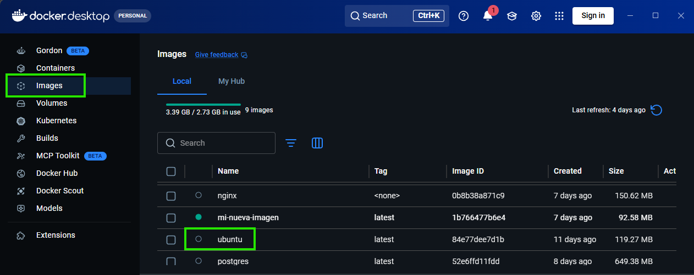

Creación y ejecución del contenedor creado
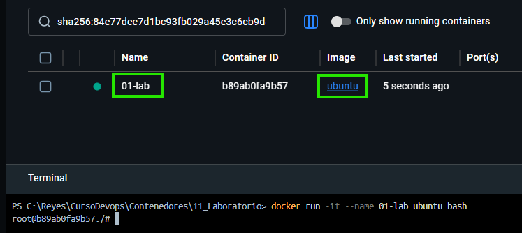

Actualización del sistema
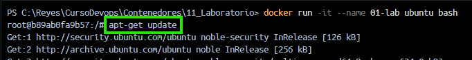

Instalación de curl
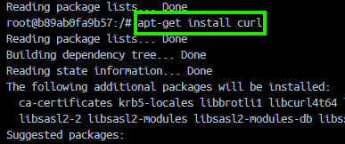

Comprobación de funcionamiento
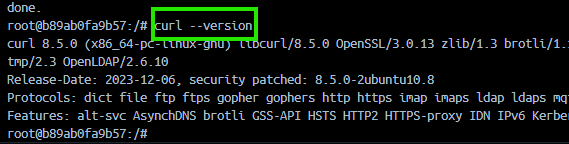

#### Pregunta 
#### ¿Con qué comando podrías guardar los cambios del contenedor como una nueva imagen?
docker commit <id_contenedor> <nombre_imagen>:<tag>
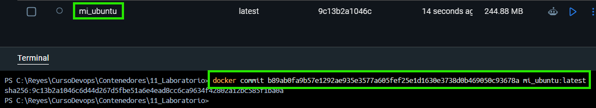
### Paso 2 (Con Dockerfile)
Creación de la imagen con Dockerfile:
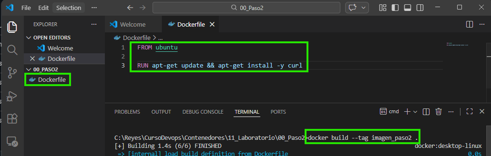

La imagen se muestra en Docker.descktop:

Nombrar la imagen para subirla a Docker Hub:
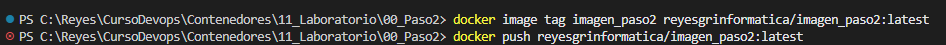

Imagen publicada en Docker Hub:
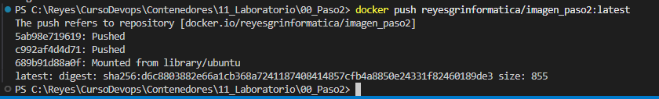

Ejecutado el contenedor basado en esa imagen y comprobado que curl está instalado:
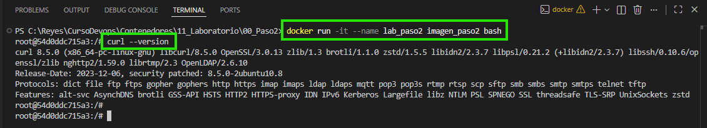

#### Pregunta 
#### ¿Qué comando permite ver las capas de una imagen Docker? docker history <nombre-imagen>
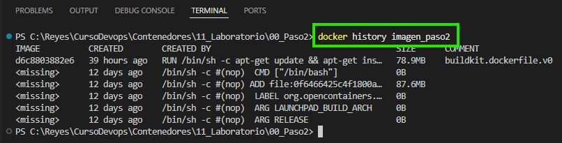

## Ejercicio 3. Volúmenes persistentes
### Paso 1 Creación, modificación e inserción de datos
Creación y ejecución de un contenedor de postgres con un volumen Docker montado en /var/lib/postgresql/data

Creación de la tabla items en la base de datos e inserción de un dato:
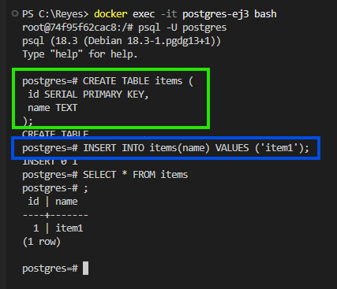

### Paso 2 Comprobación: parada y borrado del contenedor; nuevo contenedor
A continuación se muestra la parada y borrado del contenedor postgres-ej3
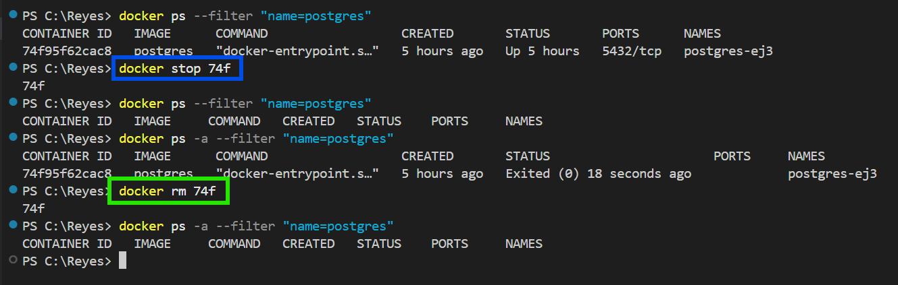

Creación de un nuevo contenedor usando el mismo volumen
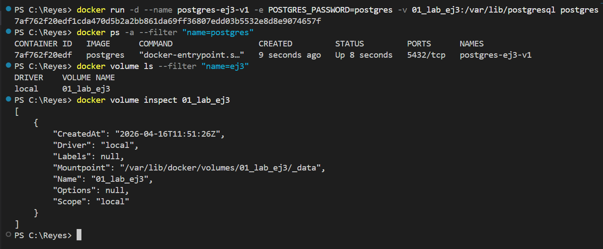

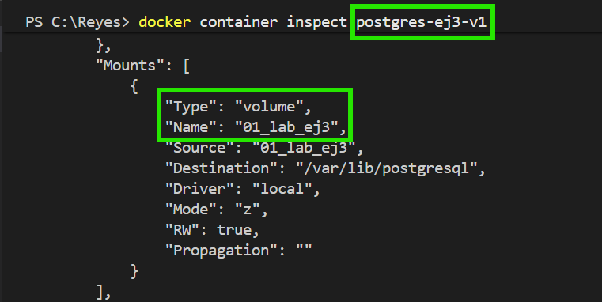

A continuación, entro en el contenedor, accedo a la base de datos y compruebo que la tabla y sus datos siguen existiendo.
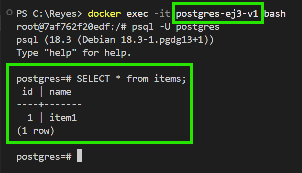

## Ejercicio 4. Bind mounts
Creo un index.html, creo y ejecuto un contenedor que mapea el puerto 9000 al 80 y cuyo volumen de tipo bind monta el archivo en /usr/share/nginx/html/index.html
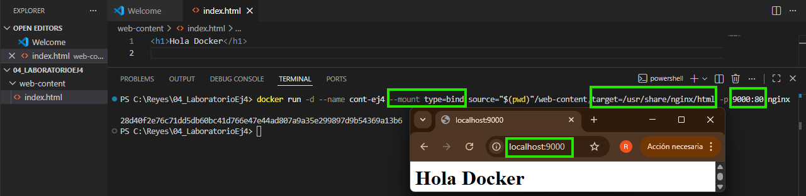

#### Pregunta
#### ¿Qué ocurre si modificas el archivo index.html en tu máquina? 
Que se actualiza en el contenedor y el cambio también se muestra en el navegador.
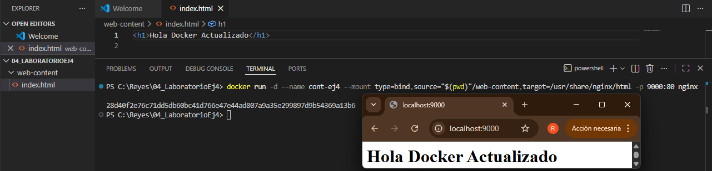

## Ejercicio 6. Creando redes privadas
Creación de la red my-net.
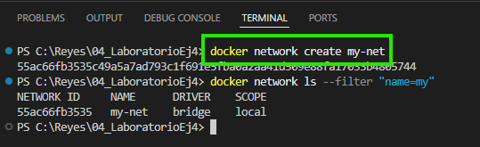

Red de tipo bridge.
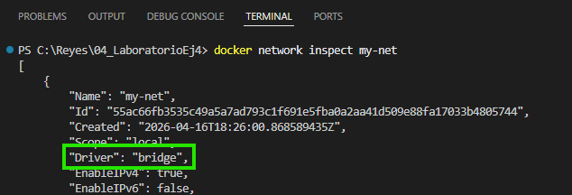

Creación de dos contenedores en la red que acabo de crear.
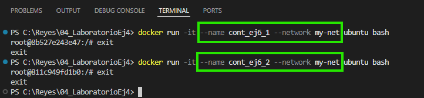

Comprobación de que están en dicha red.
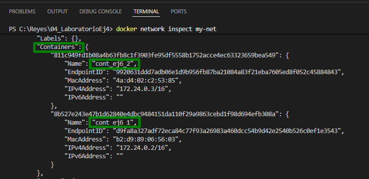

Realizar ping de un contenedor a otro.
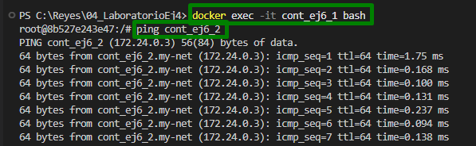

#### Pregunta
#### ¿Los contenedores pueden comunicarse entre sí?
Si, los contenedores pueden comunicarse entre sí porque están en la misma red.

## Ejercicio 9. Docker Compose --- Compartiendo volúmenes
Fichero docker-compose.yml
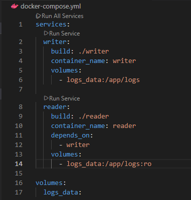

Fichero Dockerfile para el Writer
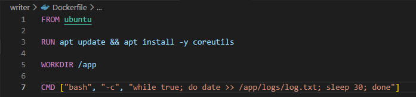

Fichero Dockerfile para el Reader
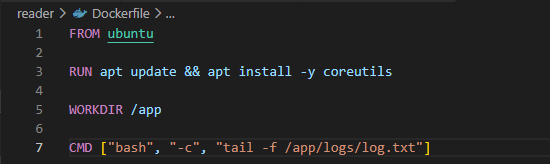

Los dos servicios en ejecución.
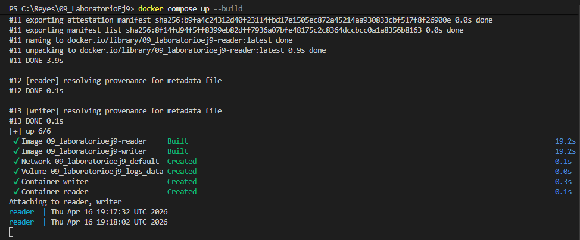
